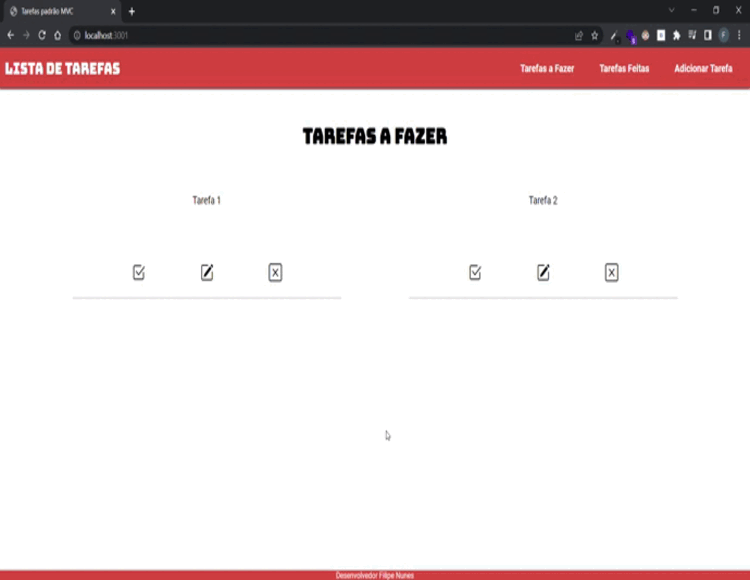

# Gerenciamento de Tarefas Front-end + Back-end.
 Gerenciador de tarefas com back-end em node.js com banco de dados Mysql e front-end feito com template handlebars.

 

#Adicione a pasta node_modules com o comando:
- npm install

**#Como configurar o arquivo .ENV:**

- PORT = porta que a aplicação vai rodar.
- DB = nome do banco de dados.
- US = usuario.
- PASSWORD = senha.
- HOTS = endereço de rede do banco de dado (caso seja no proprio computador coloque = localhost).
- TYPEDB = dialeto do banco de dados sql (caso o banco seja Mysql coloque = mysql).

#Exemplo:
- PORT = 3000.
- DB = meubanco.
- US = root.
- PASSWORD = minhasenha.
- HOTS = localhost.
- TYPEDB = mysql.

**(Ainda sem versão Mobile)
